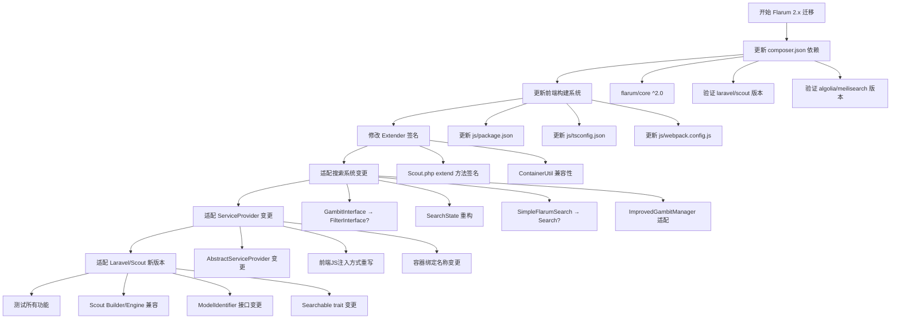

# Flarum Scout 扩展 - Flarum 2.x 适配迁移计划

## 概述

当前项目 `clarkwinkelmann/flarum-ext-scout` 基于 Flarum 1.x（`^1.2`）开发，需要适配 Flarum 2.x。本计划详细分析了所有需要修改的文件和变更点。

---

## 一、核心架构变更分析

### 1.1 Extender 系统（最关键变更）

**Flarum 2.x 重大变更：** Extender 的 `extend()` 方法签名已更改：

- **Flarum 1.x:** `extend(Container $container, Extension $extension = null)`
- **Flarum 2.x:** `extend(Container $container, ?Extension $extension = null)`

影响文件：[`src/Extend/Scout.php`](src/Extend/Scout.php:121) 第121行

```php
// 旧签名
public function extend(Container $container, Extension $extension = null)

// 新签名
public function extend(Container $container, ?Extension $extension = null)
```

### 1.2 ServiceProvider 系统

**Flarum 2.x 变更：**

- `Flarum\Foundation\AbstractServiceProvider` 可能被移除或重构为新的基类
- `Flarum\Extend\ServiceProvider` extender 的注册方式可能已更改
- 资产编译系统 `Flarum\Frontend\Assets` 和 `SourceCollector` 接口可能变更

影响文件：[`src/ScoutServiceProvider.php`](src/ScoutServiceProvider.php:1)

### 1.3 前端构建系统

**Flarum 2.x 重大变更：**

- `flarum-webpack-config` 和 `flarum-tsconfig` 可能已被新工具取代
- 前端资源注册方式从 `->js(__DIR__ . '/js/dist/admin.js')` 可能变更为新方式
- TypeScript 类型定义路径可能已更改

影响文件：

- [`js/package.json`](js/package.json)
- [`js/tsconfig.json`](js/tsconfig.json)
- [`js/webpack.config.js`](js/webpack.config.js)
- [`extend.php`](extend.php:20) 第20-21行

### 1.4 搜索系统

**Flarum 2.x 可能变更：**

- `Flarum\Search\GambitInterface` → `Flarum\Search\Filter\FilterInterface` 或类似重构
- `Flarum\Search\SearchState` 可能已重构
- `Flarum\Search\GambitManager` 可能已重命名或重构
- `Flarum\Extend\SimpleFlarumSearch` 可能已更名为 `Extend\Search`

影响文件：

- [`src/Search/DiscussionGambit.php`](src/Search/DiscussionGambit.php:1)
- [`src/Search/UserGambit.php`](src/Search/UserGambit.php:1)
- [`src/Search/ImprovedGambitManager.php`](src/Search/ImprovedGambitManager.php:1)
- [`extend.php`](extend.php:28) 第28-31行

---

## 二、逐文件修改清单

### 2.1 [`composer.json`](composer.json)

| 变更项                                               | 旧值    | 新值                                  | 优先级    |
| ---------------------------------------------------- | ------- | ------------------------------------- | --------- |
| `require.flarum/core`                                | `^1.2`  | `^2.0`                                | 🔴 必须   |
| `require.laravel/scout`                              | `^9.4`  | 需确认兼容版本（可能 ^10.0 或 ^11.0） | 🟡 需验证 |
| `require.algolia/algoliasearch-client-php`           | `^3.2`  | 需确认兼容版本                        | 🟡 需验证 |
| `require.meilisearch/meilisearch-php`                | `*`     | 需确认兼容版本                        | 🟡 需验证 |
| `require-dev.teamtnt/laravel-scout-tntsearch-driver` | `^11.6` | 需确认兼容版本                        | 🟡 需验证 |

### 2.2 [`extend.php`](extend.php)

| 行号    | 变更项                       | 说明                                         | 优先级    |
| ------- | ---------------------------- | -------------------------------------------- | --------- |
| 20-21   | `Extend\Frontend` JS注册方式 | Flarum 2.x 可能使用新的前端资源注册方式      | 🔴 必须   |
| 25-26   | `Extend\ServiceProvider()`   | 需确认 ServiceProvider extender 是否仍然存在 | 🟡 需验证 |
| 28-31   | `Extend\SimpleFlarumSearch`  | 可能已更名为 `Extend\Search`，API可能变更    | 🔴 必须   |
| 33-38   | `Extend\Console()`           | 可能已变更，需确认命令注册方式               | 🟡 需验证 |
| 121-122 | `Extend\Event()`             | 需确认事件系统是否变更                       | 🟡 需验证 |

### 2.3 [`src/Extend/Scout.php`](src/Extend/Scout.php)

| 行号 | 变更项                              | 说明                           | 优先级    |
| ---- | ----------------------------------- | ------------------------------ | --------- |
| 8    | `Flarum\Extend\ExtenderInterface`   | 需确认接口是否变更             | 🔴 必须   |
| 9    | `Flarum\Extension\Extension`        | 需确认类是否存在和签名         | 🟡 需验证 |
| 10   | `Flarum\Extension\ExtensionManager` | 需确认类是否存在               | 🟡 需验证 |
| 11   | `Flarum\Foundation\ContainerUtil`   | 需确认工具类是否变更           | 🟡 需验证 |
| 121  | `extend()` 方法签名                 | 需添加 `?` 类型声明            | 🔴 必须   |
| 170  | `$container->make('flarum')`        | 需确认 `flarum` 绑定是否仍存在 | 🟡 需验证 |

### 2.4 [`src/ScoutServiceProvider.php`](src/ScoutServiceProvider.php)

| 行号  | 变更项                                            | 说明                            | 优先级    |
| ----- | ------------------------------------------------- | ------------------------------- | --------- |
| 8     | `Flarum\Foundation\AbstractServiceProvider`       | 需确认基类是否变更              | 🔴 必须   |
| 9     | `Flarum\Frontend\Assets`                          | 需确认前端资产系统是否变更      | 🟡 需验证 |
| 10    | `Flarum\Frontend\Compiler\Source\SourceCollector` | 需确认编译系统是否变更          | 🟡 需验证 |
| 11    | `Flarum\Search\GambitManager`                     | 可能已重命名                    | 🔴 必须   |
| 62-77 | 前端JS注入逻辑                                    | 需重写，Flarum 2.x 前端架构变更 | 🔴 必须   |
| 73    | `flarum.core.compat` 引用                         | Flarum 2.x 可能移除 compat 层   | 🔴 必须   |
| 140   | `flarum.simple_search.fulltext_gambits`           | 需确认容器绑定是否变更          | 🟡 需验证 |
| 148   | `flarum.simple_search.gambits`                    | 需确认容器绑定是否变更          | 🟡 需验证 |

### 2.5 [`src/Search/DiscussionGambit.php`](src/Search/DiscussionGambit.php)

| 行号 | 变更项                             | 说明                          | 优先级  |
| ---- | ---------------------------------- | ----------------------------- | ------- |
| 8    | `Flarum\Search\GambitInterface`    | 可能已更名/重构为 Filter 接口 | 🔴 必须 |
| 9    | `Flarum\Search\SearchState`        | 可能已重构                    | 🔴 必须 |
| 14   | `apply(SearchState $search, $bit)` | 方法签名可能变更              | 🔴 必须 |

### 2.6 [`src/Search/UserGambit.php`](src/Search/UserGambit.php)

| 行号 | 变更项                          | 说明            | 优先级  |
| ---- | ------------------------------- | --------------- | ------- |
| 6    | `Flarum\Search\GambitInterface` | 可能已更名/重构 | 🔴 必须 |
| 7    | `Flarum\Search\SearchState`     | 可能已重构      | 🔴 必须 |

### 2.7 [`src/Search/ImprovedGambitManager.php`](src/Search/ImprovedGambitManager.php)

| 行号 | 变更项                        | 说明                 | 优先级    |
| ---- | ----------------------------- | -------------------- | --------- |
| 5    | `Flarum\Search\GambitManager` | 可能已更名/重构      | 🔴 必须   |
| 18   | `explode()` 方法              | 父类方法签名可能变更 | 🟡 需验证 |

### 2.8 [`src/ScoutModelWrapper.php`](src/ScoutModelWrapper.php)

| 行号 | 变更项                               | 说明                               | 优先级    |
| ---- | ------------------------------------ | ---------------------------------- | --------- |
| 6    | `Illuminate\Database\Eloquent\Model` | 需确认 Laravel 版本兼容性          | 🟡 需验证 |
| 9    | `Laravel\Scout\Searchable`           | 需确认 Scout 新版本 trait 是否变更 | 🟡 需验证 |
| 8    | `Laravel\Scout\Builder`              | 需确认 Builder 类是否变更          | 🟡 需验证 |

### 2.9 [`src/FlarumEngineManager.php`](src/FlarumEngineManager.php)

| 行号 | 变更项                                  | 说明                      | 优先级    |
| ---- | --------------------------------------- | ------------------------- | --------- |
| 9    | `Flarum\Foundation\Paths`               | 需确认类是否变更          | 🟡 需验证 |
| 14   | `Laravel\Scout\Engines\AlgoliaEngine`   | 需确认 Scout 新版本兼容性 | 🟡 需验证 |
| 15   | `TeamTNT\Scout\Engines\TNTSearchEngine` | 需确认兼容性              | 🟡 需验证 |

### 2.10 [`src/FlarumSearchableScope.php`](src/FlarumSearchableScope.php)

| 行号  | 变更项                               | 说明               | 优先级    |
| ----- | ------------------------------------ | ------------------ | --------- |
| 8     | `Illuminate\Database\Eloquent\Scope` | 需确认接口兼容性   | 🟢 低风险 |
| 60-72 | `HasManyThrough::macro`              | 需确认宏系统兼容性 | 🟢 低风险 |

### 2.11 [`src/Job/SerializesAndRestoresWrappedModelIdentifiers.php`](src/Job/SerializesAndRestoresWrappedModelIdentifiers.php)

| 行号 | 变更项                                           | 说明                         | 优先级    |
| ---- | ------------------------------------------------ | ---------------------------- | --------- |
| 6    | `Illuminate\Contracts\Database\ModelIdentifier`  | Laravel 10+ 可能已变更此接口 | 🟡 需验证 |
| 7    | `Illuminate\Contracts\Queue\QueueableCollection` | 需确认接口兼容性             | 🟡 需验证 |

### 2.12 前端文件

| 文件                                             | 变更项       | 说明                                                          | 优先级    |
| ------------------------------------------------ | ------------ | ------------------------------------------------------------- | --------- |
| [`js/package.json`](js/package.json)             | 依赖版本升级 | `flarum-tsconfig`, `flarum-webpack-config` 可能需要更新或替换 | 🔴 必须   |
| [`js/tsconfig.json`](js/tsconfig.json)           | 类型定义路径 | Flarum 2.x 类型定义路径可能已变更                             | 🔴 必须   |
| [`js/webpack.config.js`](js/webpack.config.js)   | 构建配置     | 可能需要迁移到新的构建工具                                    | 🔴 必须   |
| [`js/src/admin/index.ts`](js/src/admin/index.ts) | API 变更     | `app.extensionData` API 可能变更                              | 🟡 需验证 |

### 2.13 [`src/ScoutStatic.php`](src/ScoutStatic.php)

| 行号 | 变更项                                    | 说明                                             | 优先级    |
| ---- | ----------------------------------------- | ------------------------------------------------ | --------- |
| 11   | `Laravel\Scout\Engines\MeiliSearchEngine` | Scout 新版本可能重命名（如 `MeilisearchEngine`） | 🟡 需验证 |

---

## 三、迁移流程图



---

## 四、风险评估

### 🔴 高风险（必须修改，且可能涉及重大重构）

1. **搜索系统重构** — GambitInterface/SearchState 可能已被完全重构，这是本扩展的核心功能
2. **前端构建系统** — Flarum 2.x 可能已完全更换前端工具链
3. **Extender 签名变更** — 直接影响所有自定义 Extender

### 🟡 中风险（需验证，可能需要小改动）

1. **ServiceProvider 基类变更** — 需确认新基类
2. **Scout 包版本兼容** — Scout 10+ 可能有 API 破坏性变更
3. **容器绑定名称变更** — 内部绑定名称可能已更改
4. **前端 API 变更** — admin 设置注册 API 可能变更

### 🟢 低风险（基本兼容，可能无需修改）

1. **Eloquent 模型相关代码** — Laravel 的 Eloquent 系统相对稳定
2. **Console 命令** — 命令系统基本不变
3. **事件监听器** — 事件系统相对稳定
4. **Scope 系统** — Eloquent Scope 接口稳定

---

## 五、推荐实施步骤

### 阶段1：环境准备

1. 更新 [`composer.json`](composer.json) 中 `flarum/core` 版本为 `^2.0`
2. 验证 `laravel/scout` 在 Flarum 2.x 环境下的兼容版本
3. 更新前端构建依赖

### 阶段2：PHP 核心适配

4. 修改 [`src/Extend/Scout.php`](src/Extend/Scout.php:121) 中 `extend()` 方法签名
5. 适配 [`src/ScoutServiceProvider.php`](src/ScoutServiceProvider.php:8) 的基类和注入逻辑
6. 适配搜索系统 — [`src/Search/DiscussionGambit.php`](src/Search/DiscussionGambit.php), [`src/Search/UserGambit.php`](src/Search/UserGambit.php), [`src/Search/ImprovedGambitManager.php`](src/Search/ImprovedGambitManager.php)
7. 修改 [`extend.php`](extend.php) 中的所有 Extender 调用

### 阶段3：依赖适配

8. 适配 `laravel/scout` 新版本 API（Builder, Engine, Searchable trait 等）
9. 适配 [`src/FlarumEngineManager.php`](src/FlarumEngineManager.php) 中的引擎驱动
10. 适配 [`src/ScoutModelWrapper.php`](src/ScoutModelWrapper.php) 中的 Searchable trait 方法
11. 适配 [`src/Job/`](src/Job/) 中的队列任务序列化逻辑

### 阶段4：前端适配

12. 更新 [`js/package.json`](js/package.json) 构建依赖
13. 更新 [`js/tsconfig.json`](js/tsconfig.json) 类型定义路径
14. 更新 [`js/webpack.config.js`](js/webpack.config.js) 构建配置
15. 适配 [`js/src/admin/index.ts`](js/src/admin/index.ts) 中的 API 调用

### 阶段5：测试验证

16. 验证 Algolia 引擎功能
17. 验证 Meilisearch 引擎功能
18. 验证 TNTSearch 引擎功能
19. 验证队列模式功能
20. 验证管理面板设置
21. 验证搜索 Gambit 功能

---

## 六、关键待确认问题

在开始实施之前，需要确认以下信息：

1. **Flarum 2.x 的具体版本号和发布状态** — 当前 Flarum 2.x 是否已正式发布？需要针对哪个版本？
2. **搜索系统的具体变更** — Gambit 系统是否已重构为 Filter 系统？具体的接口名称是什么？
3. **前端构建系统的具体变更** — 是否已迁移到 Vite 或其他构建工具？
4. **ServiceProvider 的具体变更** — AbstractServiceProvider 是否仍然存在？
5. **Laravel Scout 的兼容版本** — Flarum 2.x 使用的 Laravel 框架版本决定了可兼容的 Scout 版本
